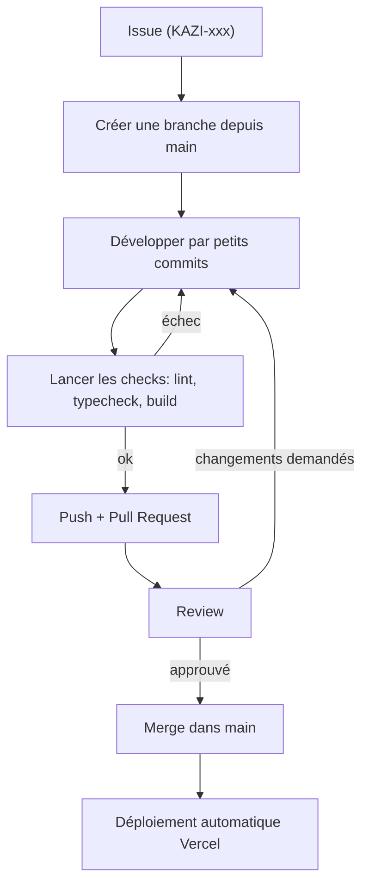

# Contribuer à Kazi

Merci de travailler sur Kazi. Ce guide explique **comment proposer un changement proprement**, même si c'est ta première contribution.

> Règle d'or : si tu hésites, demande avant de coder. Une question coûte moins cher qu'une PR à refaire.

## Avant de commencer

1. Installe le projet : [`docs/onboarding.md`](docs/onboarding.md).
2. Lis le périmètre V1 : [`docs/produit/prd.md`](docs/produit/prd.md). **Ne construis rien de ce qui est hors périmètre** (backend, comptes, recherche, paiement, dark mode…).
3. Vérifie qu'une **issue** existe pour ta tâche (`KAZI-001`, `KAZI-002`…). Sinon, crées-en une.
4. Vérifie la **Definition of Ready** : objectif clair, résultat attendu, critères d'acceptation, données connues, responsive et états définis.

## Le flux de travail



`main` est la **production**. On ne pousse jamais directement dessus : tout passe par une Pull Request, même en solo.

## Branches

| Préfixe | Usage | Exemple |
|---|---|---|
| `feature/` | Nouvelle fonctionnalité ou section | `feature/KAZI-003-hero` |
| `fix/` | Correction de bug | `fix/KAZI-021-header-overflow` |
| `docs/` | Documentation seule | `docs/KAZI-030-update-onboarding` |

Une branche = une tâche. Garde-la courte.

## Commits

Format : `type(zone): description courte à l'impératif, en anglais`

| Type | Quand |
|---|---|
| `feat` | nouvelle fonctionnalité |
| `fix` | correction |
| `docs` | documentation |
| `style` | mise en forme sans changement de logique |
| `refactor` | réorganisation sans changement de comportement |
| `chore` | outillage, configuration, dépendances |

Exemples : `feat(hero): add hero section`, `fix(header): prevent overflow`, `docs(scope): define V1`.
Commit initial du projet : `chore(init): initialize Kazi project`.

Petits commits, un sujet par commit.

## Avant d'ouvrir une Pull Request

```bash
npm run lint
npx tsc --noEmit
npm run build
```

Puis vérifie à la main : le composant s'affiche bien en **320 px, 375 px, 768 px, 1024 px, 1280 px**, se navigue **au clavier** et le focus est visible.

## Checklist de Pull Request

- [ ] La PR référence l'issue (`Closes KAZI-xxx`)
- [ ] Lint, typecheck et build passent
- [ ] La tâche respecte la [Definition of Done](docs/processus/definition-of-done.md)
- [ ] Aucun secret, aucune vraie donnée personnelle
- [ ] Aucune dépendance ajoutée sans besoin réel (sinon, expliquée dans la PR)
- [ ] Les textes de démonstration sont clairement fictifs
- [ ] Des captures d'écran (mobile + desktop) sont jointes si l'interface change

## Conventions de code

- **Composants** en PascalCase (`TalentCard.tsx`), **variables et fonctions** en camelCase, **fichiers de données** en camelCase.
- TypeScript strict : pas de `any` sans justification.
- **Client Component** (`"use client"`) uniquement si c'est nécessaire (état, événements).
- HTML sémantique : `button` pour une action, `a` pour une navigation. Jamais de `<div onClick>`.
- Tailwind : utilise les tokens du design system, évite les valeurs arbitraires répétées.
- Commentaires : explique le **pourquoi**, pas le quoi.

## Ce qu'on ne commite jamais

`node_modules`, `.next`, fichiers `.env` (utilise `.env.example`), clés ou secrets, fichiers temporaires.

## Besoin d'aide ?

Consulte [`docs/onboarding.md`](docs/onboarding.md) (section « Erreurs fréquentes »), puis ouvre une issue ou demande en review. Il n'y a pas de question bête.