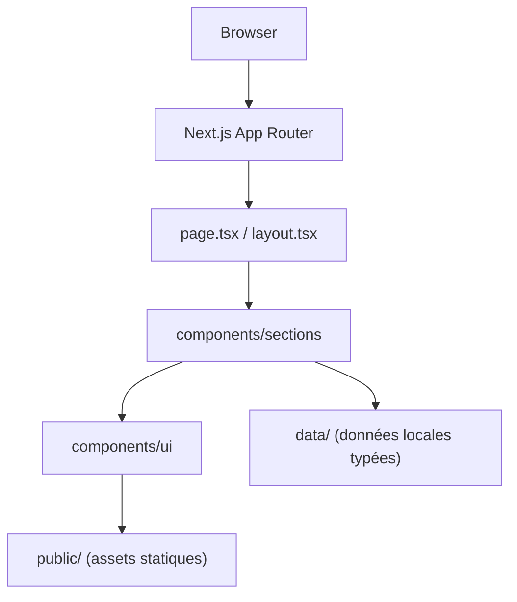
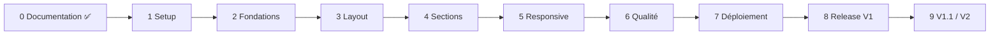

# Kazi

Kazi met en relation les **talents africains** et les **entreprises / recruteurs**.
Ce dépôt contient la **landing page V1** : une page unique, responsive, accessible et déployée sur Vercel.

> **Statut : en construction.** Les sections marquées _« À compléter »_ seront remplies au fur et à mesure de l'implémentation. Ce README ne documente que ce qui existe réellement.

## Vision

Présenter clairement Kazi, ses deux publics (talents et entreprises), des talents de démonstration, les catégories, le fonctionnement, les bénéfices et une FAQ, avec des appels à l'action clairs.

La V1 est **100 % front-end** : pas de backend, pas de compte, pas de base de données. Les contenus sont des **données de démonstration fictives**.

## Démo

_À compléter : URL Vercel après le déploiement (phase 7)._

## Screenshots

_À compléter : captures desktop et mobile à la sortie de la V1 (phase 8)._

## Stack

| Rôle | Choix |
|---|---|
| Framework | Next.js (App Router) |
| UI | React + TypeScript (strict) |
| Style | Tailwind CSS |
| Icônes | Lucide React |
| Polices | Playfair Display (titres), Inter (corps), via `next/font` |
| Hébergement | Vercel |

## Installation

Prérequis : Node.js (version LTS), Git, un éditeur de code. Détails pas à pas dans [`docs/onboarding.md`](docs/onboarding.md).

```bash
git clone <url-du-depot>
cd kazi
npm install
npm run dev
```

Le site est ensuite disponible sur http://localhost:3000.

## Scripts

_À confirmer après le setup (phase 1) : voici les scripts attendus._

| Commande | Rôle |
|---|---|
| `npm run dev` | Serveur de développement |
| `npm run build` | Build de production |
| `npm run start` | Lance le build de production en local |
| `npm run lint` | Vérification ESLint |
| `npx tsc --noEmit` | Vérification TypeScript |

## Architecture



```text
kazi/
├── docs/          # documentation (non déployée)
├── src/
│   ├── app/       # layout, page, styles globaux
│   ├── components/
│   │   ├── layout/    # Header, Footer, MobileMenu
│   │   ├── sections/  # sections de la page
│   │   └── ui/        # briques réutilisables
│   ├── data/      # données de démonstration typées
│   └── types/
└── public/        # images, favicon
```

## Documentation

Toute la documentation est dans [`docs/`](docs/README.md). Pour démarrer :

1. [`docs/onboarding.md`](docs/onboarding.md) : installer et comprendre le projet
2. [`CONTRIBUTING.md`](CONTRIBUTING.md) : comment proposer un changement
3. [`docs/processus/definition-of-done.md`](docs/processus/definition-of-done.md) : quand une tâche est terminée
4. [`docs/produit/prd.md`](docs/produit/prd.md) : le produit et son périmètre

## Accessibilité

Objectif : **WCAG 2.1 AA**. Navigation clavier, focus visible, contrastes vérifiés, respect de `prefers-reduced-motion`. _À compléter : résultats des vérifications à la sortie de la V1._

## Performance

Images et polices optimisées via Next.js, peu de JavaScript côté client. Lighthouse sert de signal de qualité, pas d'objectif de score parfait. _À compléter : résultats mesurés._

## Roadmap



Détail : [`docs/processus/roadmap.md`](docs/processus/roadmap.md).

## Auteur

_À compléter._