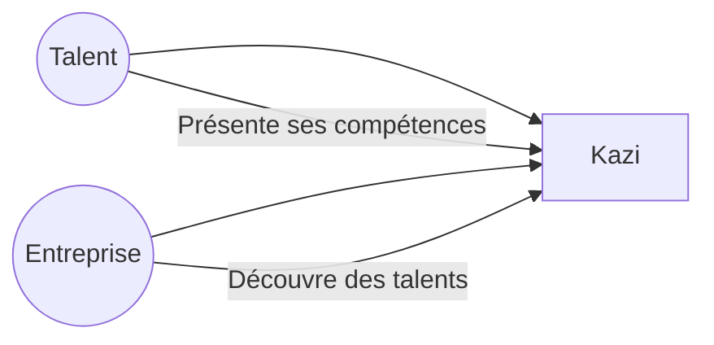
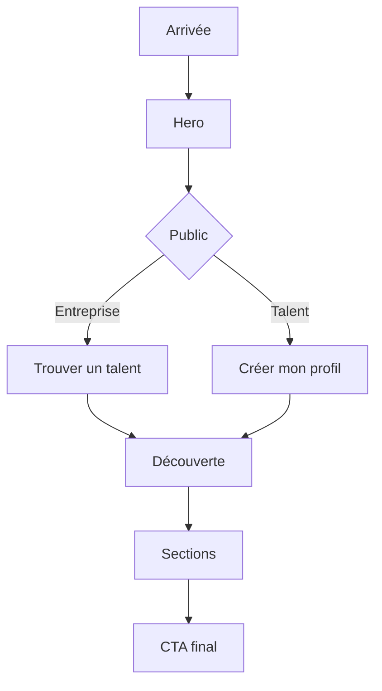
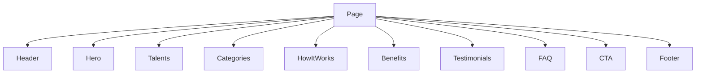
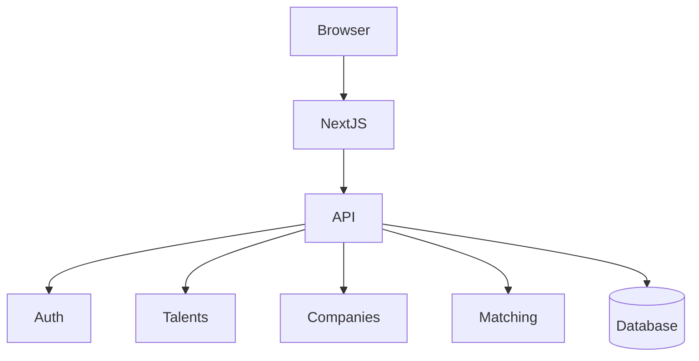
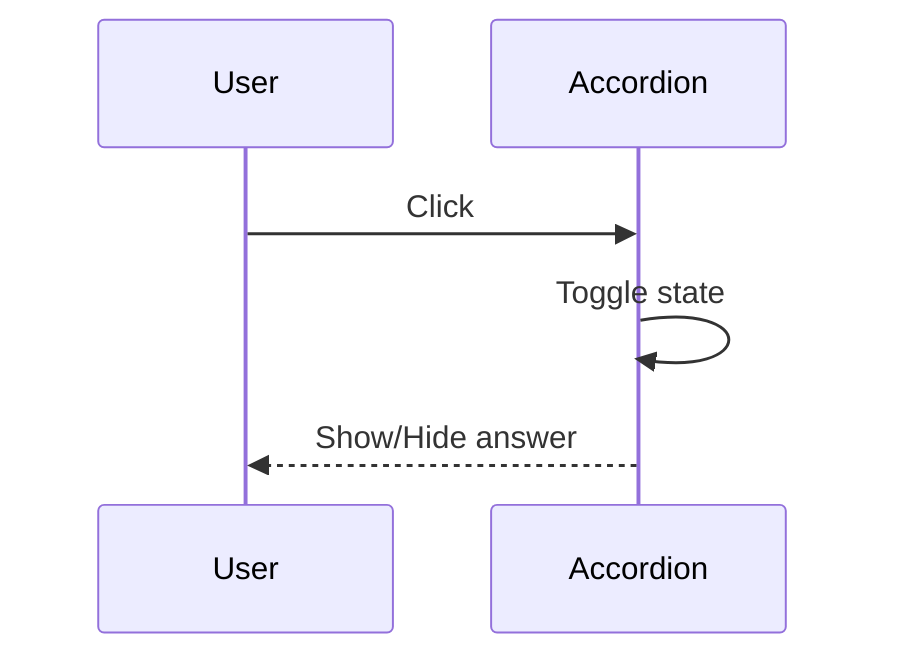

# Kazi — Diagrams

## Use Case

```mermaid
flowchart LR
Talent((Talent)) --> Kazi[Kazi]
Company((Entreprise)) --> Kazi
Talent -->|Présente ses compétences| Kazi
Company -->|Découvre des talents| Kazi
```

## User Journey

```mermaid
flowchart TD
A[Arrivée] --> B[Hero]
B --> C{Public}
C -->|Entreprise| D[Trouver un talent]
C -->|Talent| E[Créer mon profil]
D --> F[Découverte]
E --> F
F --> G[Sections]
G --> H[CTA final]
```

## Components

```mermaid
flowchart TD
Page --> Header
Page --> Hero
Page --> Talents
Page --> Categories
Page --> HowItWorks
Page --> Benefits
Page --> Testimonials
Page --> FAQ
Page --> CTA
Page --> Footer
```

## Future architecture

```mermaid
flowchart TD
Browser --> NextJS
NextJS --> API
API --> Auth
API --> Talents
API --> Companies
API --> Matching
API --> DB[(Database)]
```

## FAQ sequence

```mermaid
sequenceDiagram
User->>Accordion: Click
Accordion->>Accordion: Toggle state
Accordion-->>User: Show/Hide answer
```
