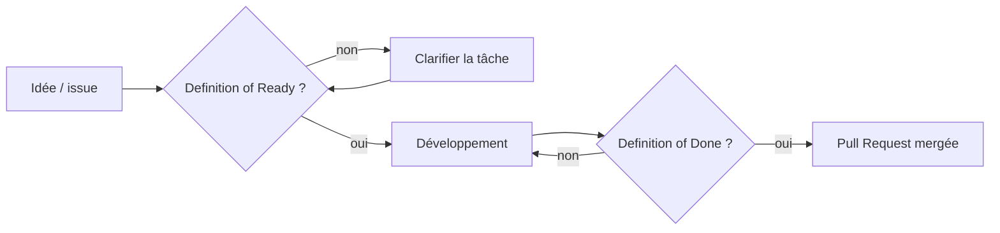

# Kazi — Definition of Done

**Version :** 1.0 · **Statut :** Remplace la version générique d'e-commerce.

Une tâche est **terminée** (Done) uniquement quand **tous** les critères applicables ci-dessous sont remplis. « Ça marche sur mon écran » ne suffit pas.

La Definition of Done est le miroir de la [Definition of Ready](definition-of-ready.md) : l'une définit quand on peut **commencer**, l'autre quand on peut **s'arrêter**.

## 1. Critères pour toute tâche de code

- [ ] Le résultat correspond aux critères d'acceptation de l'issue
- [ ] `npm run lint` passe sans erreur
- [ ] `npx tsc --noEmit` passe sans erreur
- [ ] `npm run build` réussit
- [ ] Aucune erreur ni avertissement dans la console du navigateur
- [ ] Pas de `any` inutile, pas de code mort, pas de `console.log` oublié
- [ ] Aucune dépendance ajoutée sans besoin réel
- [ ] Aucun secret ni vraie donnée personnelle dans le code
- [ ] Les valeurs de design viennent des tokens (pas de couleur ou d'espacement arbitraire répété)

## 2. Critères pour un composant ou une section

**Responsive**
- [ ] Vérifié en 320, 375, 768, 1024, 1280 et 1440+ px
- [ ] Aucun débordement horizontal
- [ ] Cibles tactiles d'au moins 44×44 px (objectif 48)

**États interactifs**
- [ ] default, hover, focus-visible, active, et disabled si pertinent
- [ ] Le hover n'est pas la seule indication (il n'existe pas sur mobile)

**Accessibilité**
- [ ] Utilisable entièrement au clavier, ordre de tabulation logique
- [ ] Focus visible
- [ ] Contraste conforme (4,5:1 texte normal, 3:1 texte large et éléments d'interface)
- [ ] HTML sémantique (`button` = action, `a` = navigation)
- [ ] `alt` pertinent sur les images informatives, `alt=""` sur les décoratives
- [ ] Hiérarchie des titres logique (un seul H1 par page)
- [ ] Animations désactivées ou réduites avec `prefers-reduced-motion`

**Contenu**
- [ ] Textes conformes à la Content Specification (ton, pas de statistique inventée)
- [ ] Contenus de démonstration clairement fictifs

## 3. Critères pour une Pull Request

- [ ] L'issue est référencée
- [ ] Les commits suivent la convention (`feat(hero): …`)
- [ ] Captures d'écran jointes si l'interface change
- [ ] Revue effectuée (même en solo : relis ton propre diff avant de merger)
- [ ] La documentation est mise à jour si le comportement ou la structure a changé

## 4. Critères pour la V1 complète

Voir la [Release Checklist](release-checklist.md) : produit, fonctionnel, responsive, accessibilité, code, production.

## 5. Cas particuliers

| Situation | Règle |
|---|---|
| Tâche de documentation seule | Seules les sections 3 et 5 s'appliquent ; les liens doivent fonctionner. |
| Tâche non applicable à un critère | Écrire « N/A » avec une raison dans la PR, ne pas simplement ignorer. |
| Critère impossible à satisfaire | Le dire dans la PR et créer une issue de suivi. Ne jamais cocher à tort. |